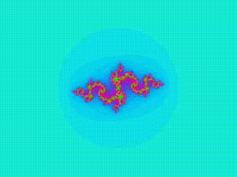

# Fractal Explorer (fractol)
_All images and videos where created with fractol_
<p align="center">




<p/>

## Description

**Fractal Explorer (fractol)** is an interactive program designed to explore and visualise various fractals, such as the Mandelbrot set, the Julia set and the Burning Ship fractal. It offers advanced controls for precision, color customisation and fractal navigation, making it an excellent tool for fractal enthusiasts and computational explorers. There are some image examples in this repository created with this program to show what you can create with it, apart from the images above.

## :zap: Features :zap:

### Navigation ↔️ ↕️ and Zoom 🔍
- **Zoom In/Zoom Out**:
- Zoom almost infinitely to explore fractals in detail.  
- **Movement**:
  - Use `W`, `A`, `S`, and `D` keys to move the view.  
  - Hold `CTRL` and move the cursor to shift the view dynamically.  

### 💻 Precision and Computation 💻
- **Increase/Decrease Precision**:
  - Press `E` to increase precision.  
  - Press `Q` to decrease precision.  
  _(Higher precision requires more computational power)_  

### 🎨 Color and Appearance 🎨
- **Adjust Color Frequency**:
  - Press `+` to increase frequency.  
  - Press `-` to decrease frequency.  
- **Change Colormap**:
  - Press `C` to switch between different color schemes.

### Fractal Selection
- Press `1` to view the Mandelbrot fractal.  
- Press `2` to view the Julia fractal.  
- Press `3` to view the Burning Ship fractal.

### Dynamic Julia Parameter
- While viewing the Julia fractal, press and hold the mouse's left button to dynamically adjust the Julia parameter to the cursor's position. Release the button to lock the parameter.

### 🖼️ Save Image 🖼️
- Press `G` to save the current fractal view as a **BMP image** in the program's folder.

## ⚒️ Execution Instructions ⚒️

1. **System Requirements**:
   - This program is compatible with Linux and Unix-based systems.  
   - Performance improves with a processor having multiple cores (as this program uses threads 🧵).  

2. **Run the Program**:
   - Execute `make` in the `/files` folder of the repository to compile the program.
   - Use the terminal to execute the program with the following arguments:  
     - **First Argument**: The fractal type (`Mandelbrot`, `Julia`, or `BurningShip`).
     - _Note: The program is camel case sensitive._
     - **Optional Arguments**:
       - **Initial Precision**: Specify as an integer.  
       - **Starting Julia Parameter**: Provide two double values (e.g., `-0.8 0.156`).  
     - _Note: Do not specify both optional arguments simultaneously._

   **Example Commands**:  
   ```bash
   ./fractol Mandelbrot 500
   ./fractol Julia -0.8 0.156
   ./fractol BurningShip

## 🗒️ Notes 🗒️
- For Julia fractals, the dynamic parameter adjustment works seamlessly with the mouse.
- Higher precision may significantly increase computation time but allows detailed exploration.
- Experiment with color frequency and colormaps to enhance visualization.
